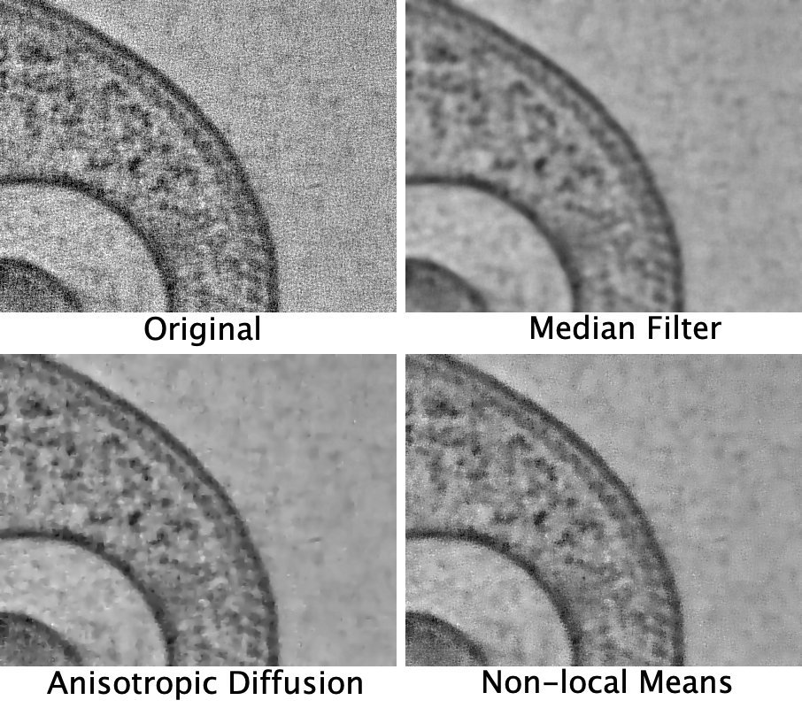
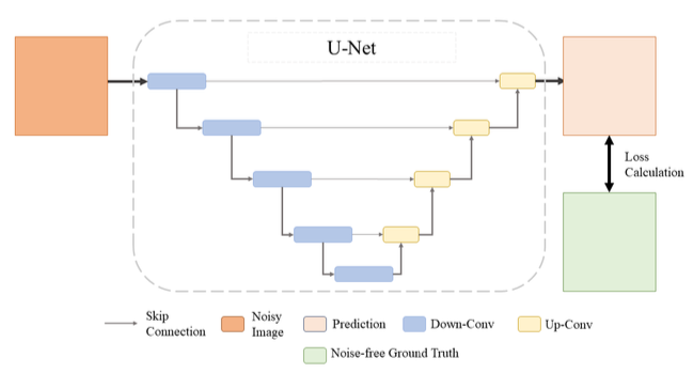
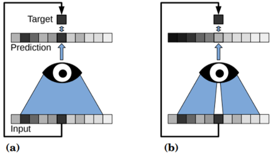
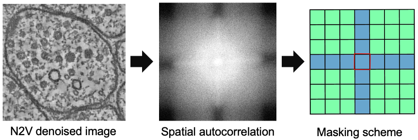
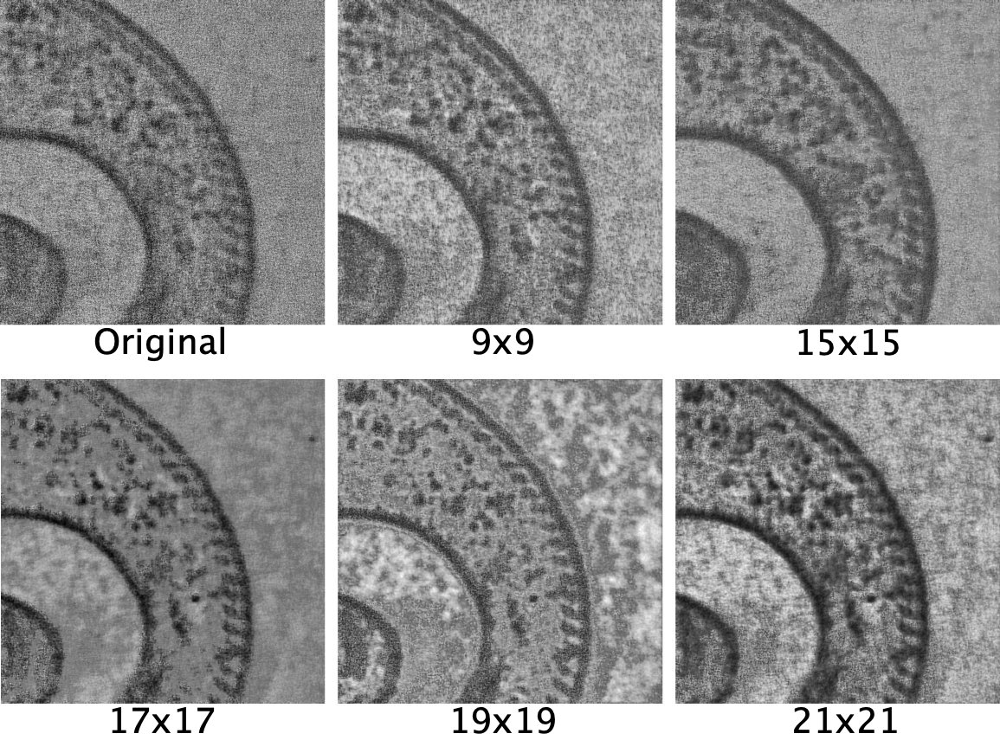

# PoP Projekt 14 - Electron Tomography Denoising Demo

This repository contains a demonstration notebook of four different methods used to denoise electron tomography images, three filter based methods and one machine-learning based method.

## Filter-based denoising

### Median Filter

The median filter removes intensity outliers in an image by replacing the value of every pixel with the median of the pixels in its sourrounding. This simple and computationally efficient method, while working well with pixel independant (unstructured) noise, introduces a not insignificant amount of blurring in high contrast areas.

### Anisotropic Diffusion

Anisotropic diffusion smooths out noise in an image while preserving important features like edges by varying the amount of diffusion based on the local gradients. It achieves this through an iterative process that selectively reduces noise more in uniform areas and less near edges. Like the median filter this algorithms effectivenes is limited when dealing with structured noise.

### Non-local Means

Non-local means filtering reduces noise by averaging each pixel in an image with other pixels that have similar intensity patterns, regardless of their location in the image. This method preserves details and textures better than local averaging because it uses information from the entire image. While this make this method adaptive to varying noise levels in a single image and able to preserve edges well, it also is computationally intensive when compared to other filter based methods.

<p align="center">
  
</p>


## Machine Learning based denoising

### Structured Noise2Void

Unlike traditional supervised denoising methods that require pairs of noisy and clean images, Noise2Void trains a U-net architecture model using only noisy images, making it especially suitable for bioimage data where obtaining clean images is challenging. This is achieved through a self-supervised learning approach where during training some pixels in the input image are masked. The model is then trained to predict the values of these masked pixels based on the surrounding unmasked pixels.

#### U-net Architecture

<p align="center">
  
</p>

Noise2Void utilizes a model of the u-net architecture consisting of an encoder, where spatial resolution of the input image is gradually reduced an prominent features are extracted and a decoder, where the image is rebuild (or predicted) from the learned features. Low level information is also being forwared through skip connections between corresponding layers in the encoder and decoder to help preserve spatial information and finde detail lost during downsampling.

#### Masking Schemes

<p align="center">
  
</p>

By masking one (Noise2Void) or more (structuredN2V) pixels during training the model is forced to predict the value of these pixels based on the surrounding unmasked pixels. 

<p align="center">
  
</p>

Depending on the type of noise in an image it is possible and very usefull to not only mask a single pixel in the input image during training but use a masking scheme of several pixels. By calculating the spatial autocorrelation of the noise of an image some structural information about the noise can be gained. In absence of a pure noise image, the spatial autocorrelation of an image denoised with N2V will yield close to the same information since after denoising only structural noise remains. After determining the shape of the masking scheme the right size must be choosen to best mask the structural noise during training while preserving the biological information.

<p align="center">
  
</p>

# How to use this notebook

This notebook is intended to be run in Google Colab but can also be used locally.

To open this notebook in Colab just click on <a href="https://colab.research.google.com/github/lucasfortune/PoP_Denoise_demo/blob/main/PoP_Denoise_demo.ipynb">this</a> link. 


If you prefer to run the notebook locally all necessary dependencies must be installed. It is recommended to install everything in a anaconda virtual environment. After installing <a href="https://docs.anaconda.com/free/anaconda/install/index.html">anaconda</a> run the folowwing commands:

```bash
conda create -n denoise_demo python=3.9
conda activate denoise_demo
conda install matplotlib tifffile scikit-image pandas
```

If you are planning on also running the Noise2Void Demo it is necessary to install n2v and Tensorflow. Please follow the installation instructions <a href="https://pypi.org/project/n2v/"> here </a>.


[def]: /Users/lucasfortune/Documents/arbeit/phd/code/denoise_demo/PoP_Denoise_demo/sources/pop_denoise_demo_filter_comp.jpg